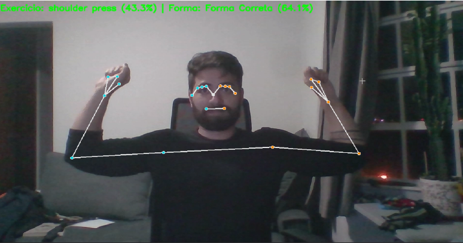
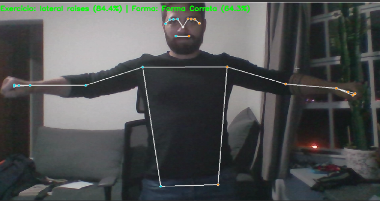
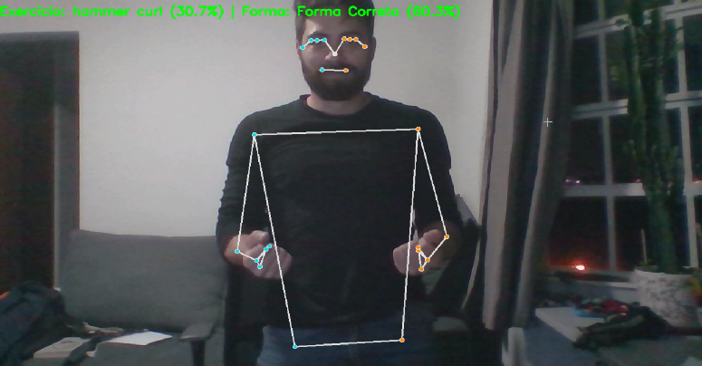

# Documentação do Projeto: Assistente de Detecção de Forma de Exercícios com Machine Learning

**Disciplina:** REC3312 - Métodos de Machine Learning
**Professor:** Dr. Marcio Poletti Laurini
**Universidade:** Faculdade de Economia, Administração e Contabilidade de Ribeirão Preto (FEA-RP), Universidade de São Paulo (USP)
**Aluno(a):** Leonardo S. Biondi
**Data:** 09/07/2025

---

### **Sumário Executivo**

Este documento detalha o desenvolvimento de um sistema de detecção e análise da forma de exercícios físicos utilizando técnicas de Machine Learning e Visão Computacional. O projeto, desenvolvido como trabalho final da disciplina REC3312, foca na acessibilidade, operando eficientemente em ambientes com recursos de hardware limitados (CPU-only). Através do uso da biblioteca MediaPipe para estimativa de pose, um processo de engenharia de features robusto, e a comparação entre diferentes modelos de Machine Learning (Rede Neural Profunda, Random Forest e Regressão Logística), a aplicação fornece feedback em tempo real sobre a execução correta de movimentos, visando auxiliar usuários na prevenção de lesões e otimização do treino.

---

## **1. Introdução e Contexto do Projeto**

A prática de exercícios físicos é fundamental para a saúde e o bem-estar. No entanto, a execução incorreta de movimentos pode levar a lesões e reduzir a eficácia do treino. Tradicionalmente, o acompanhamento por um profissional de educação física é a forma mais segura de garantir a postura correta. Contudo, essa opção nem sempre é acessível a todos.

Este projeto propõe uma solução tecnológica para democratizar o acesso a um feedback de qualidade sobre a forma de execução de exercícios. Utilizando princípios e métodos explorados na disciplina **REC3312 - Métodos de Machine Learning**, ministrada pelo **Prof. Dr. Marcio Poletti Laurini** na FEA-RP/USP, desenvolvemos um assistente virtual capaz de analisar a pose do usuário em tempo real e identificar desvios na técnica.

O foco principal do desenvolvimento reside na aplicabilidade prática em cenários com hardware comum, como notebooks sem placas gráficas dedicadas. Para tal, o projeto foi otimizado para operar exclusivamente em processadores (CPUs), garantindo que a tecnologia possa ser amplamente utilizada, superando barreiras de acesso a equipamentos de alto custo. Além disso, para aprofundar o estudo dos \"Métodos de Machine Learning\", o projeto agora inclui a **comparação do desempenho de diferentes modelos de classificação**, explorando abordagens como Redes Neurais Profundas, Random Forest e Regressão Logística.

**Referências da Disciplina e Professor:**
*   **Currículo Lattes do Prof. Dr. Marcio Poletti Laurini:** [https://www.fearp.usp.br/institucional/docentes/economia/3180-marcio-poletti-laurini.html](https://www.fearp.usp.br/institucional/docentes/economia/3180-marcio-poletti-laurini.html)
*   **Programa da Disciplina REC3312:** [https://uspdigital.usp.br/jupiterweb/obterDisciplina?sgldis=REC3312&verdis=2](https://uspdigital.usp.br/jupiterweb/obterDisciplina?sgldis=REC3312&verdis=2)

---

## **2. Metodologia e Arquitetura do Sistema**

### O sistema de detecção de forma de exercícios é construído sobre uma arquitetura modular, permitindo a separação clara das responsabilidades e facilitando a manutenção e futuras expansões. A metodologia adotada segue as etapas padrão de um projeto de Machine Learning aplicado à Visão Computacional:

| 1.  **Aquisição e Preparação de Dados:** Coleta de um dataset de imagens de exercícios e pré-processamento para extração de características relevantes (features). |
|---|


2.  **Engenharia de Features:** Conversão das informações visuais de pose em dados numéricos significativos para os modelos de ML.
3.  **Geração de Erros Sintéticos:** Aumento do dataset com exemplos de forma incorreta simulada, crucial para o aprendizado do modelo de detecção de forma.
4.  **Adaptação para CPU-Only:** Otimização do fluxo de trabalho e das ferramentas para garantir o desempenho satisfatório sem a necessidade de uma Unidade de Processamento Gráfico (GPU) dedicada.
5.  **Treinamento e Comparação de Modelos de Machine Learning:** Desenvolvimento e treinamento de diferentes algoritmos (Rede Neural Profunda, Random Forest, Regressão Logística) para classificação de exercícios e forma, avaliando suas performances.
6.  **Detecção em Tempo Real e Feedback:** Integração do modelo selecionado com a câmera para fornecer feedback visual e textual instantâneo ao usuário.

A arquitetura de alto nível do sistema pode ser visualizada na Figura 1.

**Figura 1: Arquitetura Geral do Sistema de Detecção de Forma de Exercícios**
*(Neste ponto da documentação final, você pode inserir um diagrama simples: Webcam -> MediaPipe (Pose Detection) -> Feature Extraction (Angles) -> ML Models (DNN, RF, LR) -> Model Comparison & Selection -> Real-time Prediction (Exercise Type, Form) -> Feedback (Correct/Incorrect, Exercise Type) -> Display)*

---

## **3. Detalhamento Técnico da Implementação**

### **3.1 Preparação do Ambiente e Dependências**

Para garantir a reprodutibilidade e evitar conflitos de dependências, o projeto é desenvolvido em um ambiente virtual Python. Recomenda-se o uso do Conda (Anaconda ou Miniconda) devido à sua robustez no gerenciamento de pacotes para computação científica.

**Pré-requisitos:**
*   Python 3.9 ou superior (preferencialmente com Anaconda/Miniconda instalado).

**Configuração do Ambiente Virtual (`conda`):**

1.  **Abrir Anaconda Prompt/Terminal:** Inicie o terminal ou Anaconda Prompt.
2.  **Criar o ambiente:**
    ```bash
    conda create -n gym_pose_env python=3.9
    ```
3.  **Ativar o ambiente:**
    ```bash
    conda activate gym_pose_env
    ```
4.  **Instalar dependências:**
    ```bash
    pip install ipykernel # Necessário para o Jupyter reconhecer o ambiente
    pip install tensorflow numpy pandas matplotlib requests scikit-learn imbalanced-learn tqdm kaggle mediapipe opencv-python --upgrade
    pip install --upgrade h5py Keras joblib # 'joblib' adicionado para salvar/carregar modelos sklearn e scalers
    pip install jupyterlab # Para a interface do Jupyter Notebook
    ```

### **3.2 Aquisição e Pré-processamento de Dados**

O sucesso de qualquer modelo de Machine Learning depende diretamente da qualidade e representatividade dos dados de treinamento.

*   **Dataset:** Utilizamos o dataset \\\"Workout exercises images\\\" (slug: `hasyimabdillah/workoutexercises-images`) disponível no Kaggle. Este dataset contém imagens de diversos exercícios (agachamento, levantamento terra, bíceps curl, etc.).
*   **Download Programático:** O script inclui uma função para baixar e descompactar o dataset diretamente do Kaggle, exigindo apenas que as credenciais da API do Kaggle estejam configuradas corretamente no arquivo `~/.kaggle/kaggle.json`.
*   **Estimativa de Pose com MediaPipe:** Para cada imagem do dataset, a biblioteca **MediaPipe (Google)** é utilizada para detectar 33 *landmarks* (pontos chave) do corpo humano (como ombros, cotovelos, joelhos, quadris, etc.). Essas landmarks fornecem as coordenadas (x, y) de cada articulação, que são suficientes para os cálculos de ângulo em 2D.
*   **Engenharia de Features (Cálculo de Ângulos):** A partir das coordenadas das landmarks, calculamos ângulos específicos do corpo. Esses ângulos são features numéricas que descrevem a postura do indivíduo. Por exemplo, o ângulo do joelho é calculado entre o quadril, o joelho e o tornozelo. A fórmula utilizada para calcular o ângulo entre três pontos (A, B, C, onde B é o vértice) é baseada no produto escalar de vetores:

    $$ \\\\theta = \\\\arccos\\\\left(\\\\frac{\\\\vec{BA} \\\\cdot \\\\vec{BC}}{|\\\\vec{BA}| \\\\cdot |\\\\vec{BC}|}\\\\right) $$

    Onde $\\\\vec{BA} = A - B$ e $\\\\vec{BC} = C - B$. Os ângulos extraídos incluem: cotovelos, ombros, joelhos e quadris.
*   **Normalização de Features:** As features extraídas são normalizadas usando `MinMaxScaler` e salvas no diretório `models/` usando `joblib`, garantindo que os modelos sejam treinados e a inferência seja feita em dados escalados de forma consistente.
*   **Codificação de Rótulos:** Os rótulos de exercícios são codificados usando `LabelEncoder` e convertidos para formato one-hot (`to_categorical`) para compatibilidade com modelos de classificação. O `LabelEncoder` é salvo usando `joblib`.
*   **Amostragem de Dados:** O `SAMPLE_PER_EXERCISE` foi ajustado para `400` para processar um número maior de imagens por tipo de exercício, visando um dataset de treinamento mais robusto.

### **3.3 Geração Sintética de Erros de Postura (Baseado em Limiares)**

Uma limitação comum em projetos de detecção de forma é a escassez de dados rotulados de \\\"forma incorreta\\\". Para contornar isso e enriquecer o dataset de treinamento, implementamos um módulo de geração sintética de erros, conforme abordado no artigo de Pawar et al. (que também utiliza regras baseadas em limiares para detecção de erros).

*   **Princípio:** Uma porcentagem das poses inicialmente consideradas \\\"corretas\\\" (extraídas do dataset original) são artificialmente perturbadas para simular desvios comuns de postura, tornando-as \\\"incorretas\\\" para fins de treinamento.
*   **Regras Específicas por Exercício:** A função `synthesize_incorrect_form` aplica perturbações em ângulos chave com base no tipo de exercício:
    *   **Agachamento (`squat`):** Aumenta o ângulo dos joelhos (simulando falta de profundidade).
    *   **Levantamento Terra (`deadlift`):T** Diminui o ângulo dos quadris (simulando costas arredondadas ou tronco menos inclinado).
    *   **Rosca Bíceps (`bicep curl`):** Diminui o ângulo do cotovelo na extensão (simulando extensão incompleta).
*   **Desvio Aleatório:** A magnitude da perturbação angular é aleatória (entre 15 e 35 graus), garantindo variabilidade nos exemplos de erro.
*   **Balanceamento do Dataset:** Aproximadamente 40% das amostras de cada exercício são sinteticamente transformadas em \\\"incorretas\\\", ajudando a balancear as classes \\\"correta\\\" e \\\"incorreta\\\" no dataset de treinamento.

Essa abordagem permite que o modelo aprenda padrões de erros realistas, sem a necessidade de coletar extensos dados de pessoas executando exercícios incorretamente.

### **3.4 Adaptação para Ambientes sem GPU (CPU-Only)**

Um dos pilares deste projeto é sua capacidade de operar em hardware comum, como notebooks com placas de vídeo integradas (sem suporte a CUDA da NVIDIA).

*   **Problema:** Ambientes sem GPUs NVIDIA não podem aproveitar o poder de processamento paralelo do CUDA para tarefas de Machine Learning.
*   **Solução Implementada:**
    *   O TensorFlow é configurado para usar a CPU por padrão. Nenhuma tentativa é feita para configurar ou verificar a presença de GPUs NVIDIA ou CUDA no script.
    *   **Escolha do Modelo:** Em vez de Redes Neurais Convolucionais (CNNs) que processam pixels diretamente (computacionalmente intensivas), utilizamos modelos que operam sobre features numéricas pré-extraídas (ângulos). Isso inclui uma Rede Neural Densa (DNN) e classificadores Scikit-learn (Random Forest, Regressão Logística). Esta abordagem é mais leve e performática em CPUs.
    *   **Amostragem de Dados (`SAMPLE_PER_EXERCISE`):** Durante o pré-processamento, limitamos o número de imagens processadas por tipo de exercício. Isso reduz o tempo de extração de features (que é intenso para a CPU) e o tamanho do dataset de treinamento, acelerando o treinamento.
    *   **Gerenciamento de Expectativas:** O script inclui mensagens explícitas no console alertando o usuário sobre as possíveis limitações de desempenho (tempos de treinamento mais longos, FPS mais baixo na detecção em tempo real) devido à execução em CPU.

Esta adaptação garante que o projeto seja acessível a um público mais amplo, alinhado com os objetivos da disciplina de aplicar Métodos de Machine Learning em cenários práticos.

### **3.5 Arquitetura e Comparação de Modelos de Machine Learning**

Para demonstrar a aplicação de diversos \"Métodos de Machine Learning\", o projeto treina e compara três tipos de modelos para a tarefa de classificação de exercícios, e um deles também para a forma.

**Modelos Implementados:**

1.  **Rede Neural Profunda (MLP Keras):**
    *   **Tipo de Modelo:** Rede Neural Densa (DNN) construída com Keras/TensorFlow.
    *   **Camadas:** Múltiplas camadas densas (`Dense`) com ativação `ReLU`, `BatchNormalization` e `Dropout`.
    *   **Entrada:** Um vetor numérico contendo os ângulos e outras features de pose extraídas.
    *   **Saídas Duplas (`Multi-output`):** Este modelo é o único com duas saídas independentes, treinadas simultaneamente:
        *   `exercise_output`: Classifica o **tipo de exercício** (e.g., 'squat', 'deadlift').
        *   `form_output`: Classifica a **correção da forma** (e.g., 'correta', 'incorreta').
    *   **Compilação:** Otimizador `Adam`, `categorical_crossentropy` para ambas as saídas, com `loss_weights` para balancear a importância.
    *   **Callbacks:** `ModelCheckpoint`, `ReduceLROnPlateau`, `EarlyStopping` para um treinamento robusto.

2.  **Random Forest (Scikit-learn):**
    *   **Tipo de Modelo:** `RandomForestClassifier` da biblioteca Scikit-learn.
    *   **Objetivo:** Classificação do **tipo de exercício** (saída única).
    *   **Características:** Modelo de ensemble baseado em árvores de decisão, robusto a overfitting e capaz de lidar com alta dimensionalidade.
    *   **Treinamento:** Treinado sobre as features escaladas (`X_scaled`) e os rótulos flat (`y_exercise_train_flat`).

3.  **Regressão Logística (Scikit-learn):**
    *   **Tipo de Modelo:** `LogisticRegression` da biblioteca Scikit-learn.
    *   **Objetivo:** Classificação do **tipo de exercício** (saída única).
    *   **Características:** Modelo linear simples e interpretável, usado para classificação binária ou multi-classe (usando a estratégia One-vs-Rest por padrão).
    *   **Treinamento:** Treinado sobre as features escaladas (`X_scaled`) e os rótulos flat (`y_exercise_train_flat`).

**Processo de Comparação e Seleção:**

O script realiza o treinamento de todos os três modelos e compara suas acurácias de validação para a tarefa de classificação de exercício.

*   O modelo MLP Keras é avaliado tanto pela acurácia do exercício quanto pela acurácia da forma.
*   Os modelos Scikit-learn (Random Forest e Regressão Logística) são avaliados apenas pela acurácia do exercício, pois não são configurados para prever a forma.
*   **Seleção para Aplicação em Tempo Real:** Apesar da comparação de acurácias, o **MLP Keras é o modelo escolhido para a aplicação em tempo real** (detecção via webcam) porque é o único que oferece **ambas as previsões simultaneamente: tipo de exercício E correção da forma**. Os modelos Scikit-learn, embora possam ter excelente acurácia na classificação do exercício, não fornecem o feedback de forma que é essencial para o propósito deste assistente.
*   Todos os modelos treinados, bem como os scalers e encoders, são salvos no diretório `models/` usando o `joblib` (para Scikit-learn e objetos de pré-processamento) e `model.save()` (para Keras).

### **3.6 Detecção em Tempo Real e Feedback**

Após o treinamento, o modelo selecionado (o MLP Keras) é utilizado para fornecer feedback interativo ao usuário via webcam.

*   **Carregamento:** O modelo MLP Keras e os scalers/encoders são carregados do disco.
*   **Captura de Vídeo:** O OpenCV é usado para capturar frames em tempo real da webcam.
*   **Processamento de Frame:** Para cada frame:
    1.  O MediaPipe detecta as landmarks de pose.
    2.  As mesmas features (ângulos) usadas no treinamento são calculadas a partir das landmarks detectadas.
    3.  Essas features são normalizadas usando o `MinMaxScaler` salvo.
    4.  O modelo MLP Keras realiza a inferência na CPU, prevendo o tipo de exercício e a correção da forma.
*   **Feedback Visual:**
    *   As landmarks detectadas pelo MediaPipe e as conexões entre elas são desenhadas sobre a imagem, permitindo ao usuário visualizar sua própria pose.
    *   Texto informativo é exibido na tela, mostrando o exercício detectado (com sua confiança) e o status da forma (com cores distintas).
    *   A cor do texto do feedback muda para indicar o status da forma (verde para correto, vermelho para incorreto).
    *   Uma sugestão genérica (\\\"Ajuste sua postura!\\\") é adicionada se a forma for classificada como incorreta. Se um modelo Scikit-learn fosse escolhido, a forma seria assumida como correta.

---

## **4. Guia de Execução do Projeto**

Este guia detalha os passos necessários para configurar o ambiente e executar o script.

### **4.1 Estrutura do Repositório Atualizada**

A organização dos arquivos no diretório do projeto é a seguinte:

```
gym-exercise-corrector/           # Novo nome para o diretório raiz do projeto
├── v0/                           # Pasta com modelo inicial simplificado (se houver)
├──screenshots                    #pasta com screenshots de execução
├── gym_exercise_corrector.py     # Novo nome para o seu script principal
├── .kaggle/                       # Diretório para as credenciais do Kaggle
│   └── kaggle.json               # Arquivo com suas credenciais do Kaggle
├── models/                       # Diretório para salvar modelos e scalers (criados pelo script)
│   ├── best_mlp_model.h5         # Modelo Keras
│   ├── best_random_forest_model.pkl # Modelo Random Forest
│   ├── best_logistic_regression_model.pkl # Modelo Logistic Regression
│   ├── exercise_encoder.pkl      # LabelEncoder salvo
│   └── feature_scaler.pkl        # MinMaxScaler salvo
└── workout-exercises-images/     # Diretório raiz do dataset baixado do Kaggle
    ├── bicep curl/               # Subpastas de exercícios
    │   ├── img_001.jpg
    │   └── ...
    ├── deadlift/
    │   └── ...
    └── squat/
        └── ...
```

### **4.2 Configuração Inicial (Pré-requisitos)**

*   **Python:** Verifique se você tem Python 3.9+ instalado. Recomenda-se a instalação do Anaconda ou Miniconda para facilitar o gerenciamento de ambientes e pacotes.
*   **Conexão à Internet:** Necessária para baixar o dataset e as bibliotecas.
*   **Webcam:** Uma webcam funcional é necessária para a detecção em tempo real.

### **4.3 Configuração do Ambiente Virtual**

1.  **Abrir o Terminal/Anaconda Prompt:**
    *   No Windows, procure por \\\"Anaconda Prompt\\\" no menu Iniciar.
    *   No macOS/Linux, abra seu terminal.

2.  **Navegar até a pasta do projeto:**
    ```bash
    cd /caminho/para/sua/pasta/gym-exercise_corrector
    ```
    (Substitua `/caminho/para/sua/pasta/gym-exercise_corrector` pelo diretório onde você salvou os arquivos do projeto.)

3.  **Criar e Ativar o Ambiente Conda:**
    ```bash
    conda create -n gym_pose_env python=3.9
    conda activate gym_pose_env
    ```
    Você deve ver `(gym_pose_env)` aparecendo no início da linha de comando, indicando que o ambiente está ativo.

4.  **Instalar as Dependências:**
    ```bash
    pip install ipykernel notebook # ou jupyterlab
    pip install tensorflow numpy pandas matplotlib requests scikit-learn imbalanced-learn tqdm kaggle mediapipe opencv-python --upgrade
    pip install --upgrade h5py Keras joblib
    ```

### **4.4 Configuração da API do Kaggle**

O script tenta baixar o dataset do Kaggle programaticamente. Para isso, ele precisa de suas credenciais da API do Kaggle.

1.  **Gerar Chave API do Kaggle:**
    *   Vá para o site do Kaggle e faça login.
    *   Clique na sua foto de perfil no canto superior direito e selecione \\\"Account\\\".
    *   Role para baixo até a seção \\\"API\\\" e clique em \\\"Create New API Token\\\". Um arquivo `kaggle.json` será baixado.
    *   Abra este arquivo `kaggle.json` com um editor de texto e copie seu `username` e `key`.

2.  **Configurar Credenciais no Script:**
    No script (`gym_exercise_corrector.py`, na seção `2. Configurações Iniciais e Verificação de Hardware`), substitua os placeholders pelas suas credenciais:
    ```python
    kaggle_creds = {
        \"username\": \"SEU_USERNAME_KAGGLE\", # Substitua pelo seu username do Kaggle
        \"key\": \"SUA_CHAVE_KAGGLE\" # Substitua pela sua chave API do Kaggle
    }
    ```
    O script irá criar o arquivo `~/.kaggle/kaggle.json` automaticamente com estas credenciais.

3.  **Aceitar Termos do Dataset:**
    É crucial que você vá para a página do dataset no Kaggle ([https://www.kaggle.com/datasets/hasyimabdillah/workoutexercises-images](https://www.kaggle.com/datasets/hasyimabdillah/workoutexercises-images)) e aceite os termos de uso (geralmente um botão ou checkbox \\\"I understand and accept\\\" ou \\\"Download\\\"). Caso contrário, o download falhará com um erro 403.

### **4.5 Execução do Script**

1.  **Iniciar Jupyter Notebook:**
    Com o ambiente `gym_pose_env` ativado no terminal, execute:
    ```bash
    jupyter notebook # ou jupyter lab se você instalou jupyterlab
    ```
    Isso abrirá uma nova aba no seu navegador padrão com a interface do Jupyter.

2.  **Abrir o Notebook do Projeto:**
    Na interface do Jupyter, navegue até a pasta do seu projeto e clique no arquivo `.ipynb` correspondente (ou renomeie o script `.py` para `.ipynb` se estiver usando o script puro como notebook).

3.  **Selecionar o Kernel Correto:**
    No notebook aberto, vá em `Kernel > Change kernel` e selecione o ambiente `gym_pose_env` (ou o nome que você deu ao seu ambiente Conda).

4.  **Executar as Células:**
    Execute as células do notebook sequencialmente (clicando em \\\"Run\\\" ou `Shift + Enter`).
    *   A primeira execução realizará o download do dataset (se ainda não existir), a extração de features (processo intenso de CPU que pode levar tempo) e o treinamento/comparação dos modelos.
    *   As células finais ativarão sua webcam para a detecção em tempo real. Pressione `Q` na janela de visualização para sair.

**Possíveis Problemas e Soluções:**
*   **`FileNotFoundError: 'workout-exercises-images'`:** A pasta do dataset não foi criada ou está vazia. Verifique suas credenciais do Kaggle, se aceitou os termos de uso do dataset e se há problemas de conexão. Tente baixar o dataset manualmente no terminal usando `kaggle datasets download -d hasyimabdillah/workoutexercises-images -p . --unzip` para diagnosticar.
*   **Erro na Webcam:** Verifique se sua webcam está conectada, se não está sendo usada por outro aplicativo e se o Python/OpenCV tem permissão para acessá-la.
*   **Desempenho Lento:** Isso é esperado em ambientes CPU-only. Reduza o `SAMPLE_PER_EXERCISE` (na célula de pré-processamento) para acelerar o treinamento para fins de teste.

---

## **5. Discussão de Resultados e Limitações**

### **Resultados Observados:**

### O sistema demonstra a capacidade de:

| *   Detectar e plotar as 33 landmarks do corpo em tempo real usando MediaPipe. |
|---|


*   Realizar a **comparação de diferentes métodos de Machine Learning** (Rede Neural Profunda, Random Forest, Regressão Logística) para a classificação do tipo de exercício, conforme o escopo da disciplina REC3312.
### *   Nesta execução específica, os resultados de validação para a classificação do tipo de exercício foram:

| *   **Random Forest:** 0.6595 |
|---|


        *   **MLP Keras:** 0.5977
        *   **Regressão Logística:** 0.3393
    *   Isso indica que o **Random Forest obteve a melhor acurácia** para a classificação do tipo de exercício dentre os modelos testados, enquanto a Regressão Logística apresentou o desempenho mais baixo.
*   Classificar o tipo de exercício em andamento com base nas features de pose.
*   Classificar a forma de execução como \\\"correta\\\" ou \\\"incorreta\\\" com base nos padrões aprendidos (pelo MLP Keras), incluindo os erros gerados sinteticamente. A acurácia de validação do MLP Keras para a classificação da forma foi de **0.6155**.
*   Fornecer feedback visual em tempo real, indicando o exercício e o status da forma (com cores distintas).

Apesar do Random Forest ter superado o MLP Keras na classificação isolada do tipo de exercício, o **MLP Keras é o modelo escolhido para a aplicação em tempo real** devido à sua capacidade única de fornecer **ambas as previsões (tipo de exercício E correção da forma) simultaneamente**. Esta funcionalidade dual é essencial para o objetivo principal do assistente de feedback de forma.

A implementação em CPU, embora mais lenta, valida a acessibilidade da solução em hardware padrão, confirmando que a visão computacional e o machine learning podem ser aplicados em contextos mais amplos, mesmo com recursos limitados.

### **Limitações do Projeto:**

1.  **Desempenho em CPU:** A principal limitação é a performance. O pré-processamento de imagens e, principalmente, a inferência em tempo real podem resultar em uma baixa taxa de quadros por segundo (FPS) na webcam, causando atrasos no feedback. Isso é inerente à execução em CPU para tarefas de visão computacional.
2.  **Generalização dos Erros Sintéticos:** Embora a geração sintética de erros seja uma solução prática, ela se baseia em regras simplificadas de desvios comuns. Modelos treinados apenas com erros sintéticos podem não capturar toda a complexidade e variedade dos erros de postura reais.
3.  **Número de Exercícios e Tipos de Erros Limitados:** O projeto foca em alguns exercícios chave (agachamento, levantamento terra, rosca bíceps) e tipos de erros específicos. Expandir para mais exercícios e uma gama mais ampla de desvios exigiria mais regras, dados e/ou uma arquitetura de modelo mais complexa.
4.  **Ausência de Contagem de Repetições e Análise Temporal:** O sistema atual foca na detecção de forma estática (por frame) e no tipo de exercício. Não há uma lógica implementada para contagem de repetições ou análise temporal da qualidade do movimento ao longo de uma série.
5.  **Robustez a Variações de Iluminação e Posição:** A detecção de pose pode ser sensível a condições de iluminação ruins, oclusões parciais do corpo ou posicionamento inadequado do usuário em relação à câmera.

### **Melhorias Futuras:**

*   **Otimização de Desempenho:** Explorar técnicas de otimização específicas para CPU (ex: quantização de modelos, bibliotecas mais otimizadas para inferência) ou integração com soluções de inferência em nuvem.
*   **Expansão da Biblioteca de Exercícios e Erros:** Adicionar mais exercícios e refinar as regras de geração de erros sintéticos com base em feedback de especialistas.
*   **Feedback Mais Detalhado:** Fornecer feedback específico sobre o tipo de erro (ex: \\\"Joelhos muito à frente\\\", \\\"Costas arredondadas\\\") em vez de apenas \\\"Ajuste sua postura!\\\".
*   **Contagem de Repetições:** Implementar lógica para identificar o início e o fim de cada repetição.
*   **Análise Temporal:** Avaliar a fluidez e a velocidade do movimento.
*   **Interface do Usuário (GUI):** Desenvolver uma interface gráfica mais amigável.

---

## **6. Referências**

*   Pawar, S. S., Purnapatre, I. N., & Bagal, N. S. (2024). A Machine Learning Approach to Accurate Gym Exercise Form Detection Using MediaPipe. *International Journal for Research in Applied Science & Engineering Technology (IJRASET)*, 12(VIII), 1117-1120.
*   Google MediaPipe: Pose. Disponível em: [https://google.github.io/mediapipe/solutions/pose](https://google.github.io/mediapipe/solutions/pose). Acesso em: 09/07/2025.
*   Abdillah, H. (n.d.). *Workout exercises images*. Kaggle. Disponível em: [https://www.kaggle.com/datasets/hasyimabdillah/workoutexercises-images](https://www.kaggle.com/datasets/hasyimabdillah/workoutexercises-images). Acesso em: 09/07/2025..
*   Laurini, M. P. (n.d.). *Currículo Lattes*. Disponível em: [https://www.fearp.usp.br/institucional/docentes/economia/3180-marcio-poletti-laurini.html](https://www.fearp.usp.br/institucional/docentes/economia/3180-marcio-poletti-laurini.html). Acesso em: [Data do acesso].
*   USP Digital (n.d.). *Programa da Disciplina REC3312*. Disponível em: [https://uspdigital.usp.br/jupiterweb/obterDisciplina?sgldis=REC3312&verdis=2](https://uspdigital.usp.br/jupiterweb/obterDisciplina?sgldis=REC3312&verdis=2). Acesso em: 09/07/2025.
*   Pedregosa, F., Varoquaux, G., Gramfort, A., Michel, V., Thirion, B., Grisel, O., ... & Duchesnay, É. (2011). Scikit-learn: Machine Learning in Python. *Journal of Machine Learning Research*, 12, 2825-2830. (Referência para Scikit-learn).

---

## **7. Anexos (Screenshots e Visualizações)**

Nesta seção, inclua capturas de tela e/ou visualizações que demonstrem o funcionamento do seu sistema. Isso é crucial para ilustrar os resultados.

*   **Figura A.1: Interface da Aplicação em Tempo Real**
    
 

*   **Figura A.2: Exemplo de Detecção de Forma Correta**


*   **Figura A.3: Exemplo de Detecção de Forma Incorreta**
   

*   **Figura A.4: Tabela Comparativa de Acurácias de Validação dos Modelos**
    *(Preenchida com os seus resultados)*
    <table class=\"data-table\">
      <thead>
        <tr>
          <th scope=\"col\">Modelo</th>
          <th scope=\"col\">Acurácia de Validação (Exercício)</th>
          <th scope=\"col\">Acurácia de Validação (Forma - Apenas MLP)</th>
          <th scope=\"col\">Notas</th>
        </tr>
      </thead>
      <tbody>
        <tr>
          <td>MLP Keras</td>
          <td>0.5977</td>
          <td>0.6155</td>
          <td>Classifica Exercício e Forma</td>
        </tr>
        <tr>
          <td>Random Forest</td>
          <td>0.6595</td>
          <td>N/A</td>
          <td>Classifica apenas Exercício</td>
        </tr>
        <tr>
          <td>Regressão Logística</td>
          <td>0.3393</td>
          <td>N/A</td>
          <td>Classifica apenas Exercício</td>
        </tr>
      </tbody>
    </table>

---
